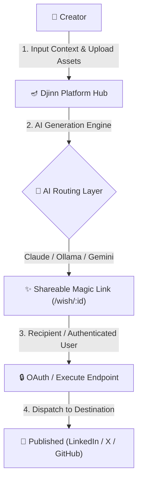
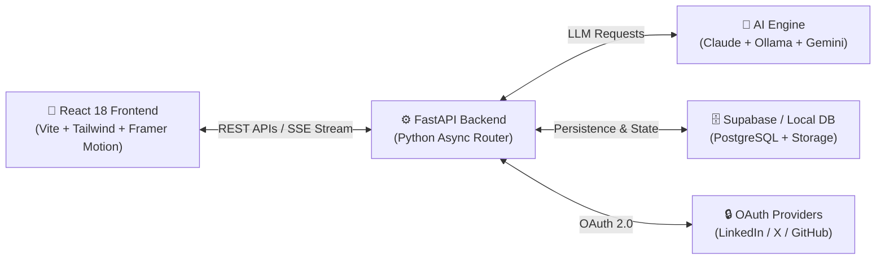
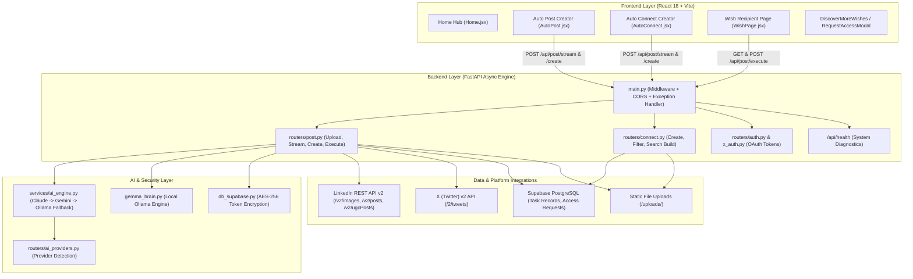

# 🪔 Djinn — Omni-Platform AI Action Agent

> **Djinn! - Every AI agent works for the person who has it. Djinn is the first you can share**

[](https://djinn-rho.vercel.app/)
[](https://djinn-rho.vercel.app/)
[](https://djinn-rho.vercel.app/)
[](https://djinn-rho.vercel.app/)

---

## 🎥 Demo Video & Live Deployment

* **Live Frontend Application:** [https://djinn-rho.vercel.app/](https://djinn-rho.vercel.app/)
* **Backend Health Check Endpoint:** [https://djinn-backend.onrender.com/api/health](https://djinn-backend.onrender.com/api/health)
* **Demo Video:** [https://youtu.be/DoRUjv9CMS0](https://youtu.be/DoRUjv9CMS0)

---

## 📌 Problem Statement & Overview

* **Hackathon Context:** Smart India Hackathon (SIH) / Open Innovation
* **Problem Statement ID:** SIH26202
* **Title:** Autonomous Multi-Platform AI Action Agent for Cross-Channel Workflow Execution

### Problem Statement
Modern professionals, founders, and developers spend hundreds of hours manually coordinating repetitive digital actions—drafting social posts, uploading media assets across platforms, managing connection requests, and coordinating team workflows. Existing tools rely on static scheduling or fragile manual copy-pasting, creating friction, credential exposure risks, and constant context switching.

### Project Overview
**Djinn** is an intelligent AI Action Agent platform that converts natural language intent and media assets into automated execution workflows ("Wishes"). Users can upload media, stream AI-generated captions in real time via Claude 3.5 Sonnet (with automatic fallback to local Ollama/Qwen2.5 and Gemini), preview exact post layout renderings across platforms, refine content, and dispatch secure encrypted Magic Links (`/wish/[id]`). Recipients or automated runners complete the execution via one-click OAuth authorization or direct API integrations—ensuring zero credential sharing, 24-hour single-use link expiration, and AES-256 link token security.

---

## ⚙️ How Djinn Functions

### 1. Simplified System Flowchart


### 2. Full System Execution Flowchart

```mermaid
flowchart TD
    subgraph Creator_Side ["Creator Workflow"]
        A1["Open AutoPost (/post) or AutoConnect (/connect)"] --> A2["Provide Context, Target Role, Location or Upload Images"]
        A2 --> A3["POST /api/post/stream or /api/connect/create"]
        A3 --> A4{"AI Provider Cascade"}
        A4 -->|"Primary"| A5["Claude 3.5 Sonnet API"]
        A4 -->|"Fallback 1"| A6["Ollama Local (Qwen2.5 / Gemma)"]
        A4 -->|"Fallback 2"| A7["Gemini 1.5 Pro / Template"]
        A5 & A6 & A7 --> A8["Stream Render / Draft Generated"]
        A8 --> A9["POST /api/post/create or /api/connect/create"]
        A9 --> A10["Generate Encrypted Wish ID (post_* / connect_*)"]
        A10 --> A11["Return Shareable Link: /wish/:id"]
    end

    subgraph Recipient_Side ["Recipient / Execution Workflow"]
        B1["Open Magic Link (/wish/:id)"] --> B2["GET /api/post/:id or /api/connect/:id"]
        B2 --> B3["Render Social Preview & Review Interface"]
        B3 --> B4{"User Action"}
        B4 -->|"Edit Wish"| B5["Refine Caption / Images & PUT /api/post/:id"]
        B4 -->|"Grant Wish"| B6["Initiate OAuth (/api/auth/linkedin/login)"]
        B6 --> B7["Exchange Code for Access Token"]
        B7 --> B8["POST /api/post/execute/:id or /api/connect/execute/:id"]
        B8 --> B9{"Execute Destination Action"}
        B9 -->|"LinkedIn Post"| B10["Upload Binary & Publish to Feed (/v2/posts)"]
        B9 -->|"LinkedIn Connect"| B11["Construct Search URL & Copy Note"]
        B10 --> B12["Return Direct Post URL (linkedin.com/feed/update/...)"]
        B11 --> B13["Return Target Profiles & Personalised Note"]
        B12 & B13 --> B14["Render Success Screen (Wish Granted ✨)"]
    end
```


---

## 🏗️ System Architecture

### 1. Simplified Architecture Diagram


### 2. Full Detailed Architecture Diagram


---

## 📑 Step-by-Step Functioning

### A. LinkedIn Auto Post Flow
1. **Creator Intent:** The creator navigates to `/auto-post`, selects destination platform (LinkedIn or X), inputs context instructions, and uploads up to 6 image files.
2. **Media & Caption Generation:** Uploaded files are posted to `/api/post/upload`. The frontend initiates an SSE stream to `/api/post/stream` where `AIEngine` generates a structured, engaging caption using Claude 3.5 Sonnet (with automatic fallback to local Ollama and Gemini).
3. **Wish Summoning:** The creator clicks **Summon Your Djinn**. `POST /api/post/create` saves the wish state and generates a unique, shareable link format: `/wish/post_[unique_id]`.
4. **Recipient Preview & Editing:** The recipient opens the Magic Link (`/wish/[id]`). The page fetches post data via `GET /api/post/[id]` and renders an exact live preview card (`SocialPreview.jsx`). The recipient can click **Edit Wish** to modify text or swap images.
5. **OAuth Authorization & Execution:** Clicking **Grant** triggers OAuth redirect via `GET /api/auth/linkedin/login?wish_id=[id]`. Upon returning with an access token, `POST /api/post/execute/[id]` uploads media binary buffers via LinkedIn's modern Images API (`/v2/images?action=initializeUpload`) and publishes the post via LinkedIn `/v2/posts` or `/v2/ugcPosts`.
6. **Result Verification:** The backend returns a valid feed URL (`https://www.linkedin.com/feed/update/urn:li:share:.../`). The recipient screen displays confetti and the live post link.

### B. LinkedIn Auto Connect Flow
1. **Campaign Creation:** The creator navigates to `/auto-connect`, specifies the target role (e.g., *Product Manager*), target location (e.g., *San Francisco*), and a custom connection message.
2. **Wish Persistence:** `POST /api/connect/create` persists the campaign parameters and generates a shareable link `/wish/connect_[unique_id]`.
3. **Recipient Execution:** The recipient opens the connection link (`/wish/[id]`), views target metrics, and clicks **Grant this Wish**.
4. **Search URL & Message Copying:** The system constructs a targeted LinkedIn URL encoding role and location (`https://www.linkedin.com/search/results/people/?keywords=[role]+[location]`) and presents a 1-click **Copy Personalised Note** button along with a direct button to launch LinkedIn Search.

---

## ✨ Features & UI

* **Omni-Platform AI Creator (`/post`):** Real-time word-by-word streaming caption generator, multi-image carousel manager, and live LinkedIn/X card previewer.
* **Interactive Magic Link Preview (`/wish/:id`):** Isolated recipient view with real-time text editing, AI content regeneration, and 1-click OAuth granting.
* **Network Automation Hub (`/connect`):** Structured outreach builder with quick templates (Sales, Job Seeker, Partnership) and target parameter previews.
* **Discover More Wishes Directory (`DiscoverMoreWishes.tsx`):** Category-filtered discovery engine featuring 15 "Wish" topics, active tool routing, and collapsible topic exploration.
* **Request Access Workflow (`RequestAccessModal.tsx`):** Animated request modal for upcoming tools connected to Supabase persistence and real-time SMTP admin notifications.
* **System Diagnostics Dashboard (`/api/health`):** Real-time monitoring of Supabase connectivity, Claude API status, and local Ollama server reachability.

---

## 🛠️ Detailed Tech Stack Breakdown

### Programming & Scripting Languages
| Language | Version / Specification | Usage |
|---|---|---|
| **Python** | 3.10+ | FastAPI backend services, LLM routing, OAuth handlers |
| **JavaScript (ES6+) / JSX** | React 18 | Client-side application logic, interactive UI components |
| **TypeScript** | 5.7+ | Type-safe data structures (`allWishes.ts`, `DiscoverMoreWishes.tsx`) |
| **HTML5 / CSS3** | Tailwind CSS 3.4 | Custom design system, responsive grid layouts, animations |

### Technologies, Frameworks & Libraries
| Layer | Technology / Library | Version | Purpose |
|---|---|---|---|
| **Frontend** | React | 18.3.1 | Core UI component framework |
| **Frontend** | Vite | 6.0.0 | High-performance frontend build tool & dev server |
| **Frontend** | Tailwind CSS | 3.4.19 | Utility-first styling & custom design tokens |
| **Frontend** | Framer Motion | 12.38.0 | Page transitions, modal animations, and micro-interactions |
| **Frontend** | Lucide React | 1.8.0 | Icon system across creator and recipient screens |
| **Frontend** | Axios | 1.14.0 | HTTP client for REST API communication |
| **Frontend** | React Router DOM | 7.14.0 | Single-page app routing (`/post`, `/connect`, `/wish/:id`) |
| **Backend** | FastAPI | 0.110.0+ | High-speed async web framework & API routing |
| **Backend** | Uvicorn | 0.29.0+ | ASGI server implementation |
| **Backend** | HTTPX | 0.25.0+ | Async HTTP client for OAuth token exchange & API calls |
| **Backend** | Pydantic / Pydantic Settings | 2.6.4+ | Schema validation and environment settings parser |
| **Backend** | Cryptography (Fernet) | 42.0.0+ | AES-256 link token & credential encryption |
| **AI Layer** | Anthropic Python SDK | 0.21.0+ | Primary LLM engine (Claude 3.5 Sonnet) |
| **AI Layer** | Ollama / Qwen2.5 | Local (11434) | Privacy-first local LLM fallback engine |
| **AI Layer** | Google Generative AI | 0.4.0+ | Secondary LLM fallback engine (Gemini) |
| **Data & Storage** | Supabase Python SDK | 2.4.0+ | PostgreSQL task records & access request persistence |
| **Data & Storage** | Python Multipart / Pillow | 10.3.0+ | Image file upload processing & buffer management |

---

## 🚀 Environment & Setup

### Prerequisites
* Python 3.10 or higher
* Node.js 18.0 or higher
* npm or yarn
* (Optional) Ollama installed locally for local LLM fallback

### Environment Variables (`backend/.env`)
Create a `.env` file inside the `backend` directory:
```env
# AI Model Configuration
ANTHROPIC_API_KEY=your_anthropic_api_key_here
GEMINI_API_KEY=your_gemini_api_key_here

# LinkedIn OAuth Configuration
LINKEDIN_CLIENT_ID=your_linkedin_client_id
LINKEDIN_CLIENT_SECRET=your_linkedin_client_secret
LINKEDIN_REDIRECT_URI=http://localhost:8000/api/auth/linkedin/callback

# X (Twitter) OAuth Configuration
X_CLIENT_ID=your_x_client_id
X_CLIENT_SECRET=your_x_client_secret
X_REDIRECT_URI=http://127.0.0.1:8000/api/auth/x/callback

# Supabase Storage & Database (Optional — falls back to local in-memory DB)
SUPABASE_URL=your_supabase_url
SUPABASE_KEY=your_supabase_anon_key

# App Configuration
APP_ENV=development
FRONTEND_URL=http://localhost:5173
ENCRYPTION_KEY=your_32_byte_fernet_encryption_key
```

### Local Execution Instructions

#### 1. Setup Backend
```bash
cd backend
python -m venv venv
# On Windows: venv\Scripts\activate | On macOS/Linux: source venv/bin/activate
pip install -r requirements.txt
python -m uvicorn main:app --reload --port 8000
```
Backend API will be live at `http://127.0.0.1:8000` (Swagger docs at `http://127.0.0.1:8000/docs`).

#### 2. Setup Frontend
```bash
cd frontend
npm install
npm run dev
```
Frontend application will be live at `http://localhost:5173`.

#### 3. (Optional) Local Ollama Fallback Setup
```bash
ollama run qwen2.5
```

---

## 📁 Repository Structure

```
Djinn/
├── README.md                      # Platform documentation & architecture guide
├── package-lock.json
│
├── backend/                       # FastAPI Backend Engine
│   ├── .env                       # Local environment variables
│   ├── .env.example               # Template environment configuration
│   ├── main.py                    # FastAPI entrypoint, CORS, exception handlers, /api/health
│   ├── models.py                  # Pydantic request & response data models
│   ├── settings.py                # Environment configuration loader
│   ├── db.py                      # JSON file database persistence fallback
│   ├── db_supabase.py             # Supabase client & AES-256 token encryption
│   ├── gemma_brain.py             # Local Ollama AI generation wrapper
│   ├── requirements.txt           # Python dependencies manifest
│   │
│   ├── routers/                   # Modular API Endpoint Routers
│   │   ├── access_requests.py     # Request Access form handler
│   │   ├── ai_providers.py        # Automated AI key detector & router
│   │   ├── auth.py                # LinkedIn OAuth authorization & token callback
│   │   ├── connect.py             # AutoConnect wish creation & search URL generator
│   │   ├── github.py              # GitHub OAuth & repository push handlers
│   │   ├── growth.py              # VC outreach & email campaign endpoints
│   │   ├── opportunity.py         # Job & scholarship application endpoints
│   │   ├── post.py                # Image upload, SSE stream, wish creation & execution
│   │   ├── workflow.py            # B2B workflow & portal blueprints
│   │   └── x_auth.py              # X (Twitter) OAuth PKCE handlers
│   │
│   ├── services/                  # Business Logic Services
│   │   ├── ai_engine.py           # Multi-provider LLM cascade (Claude -> Gemini -> Ollama -> Mock)
│   │   ├── ai_readme.py           # Project README generator service
│   │   ├── email_service.py       # SMTP notification mailer for access requests
│   │   ├── github_service.py      # PyGitHub API integration service
│   │   └── guardian.py            # Pre-push secret & API key scanner
│   │
│   ├── migrations/                # Database SQL Schemas
│   │   ├── access_requests.sql    # Access requests table DDL
│   │   ├── expansion.sql          # Platform expansion DDL
│   │   ├── github_hub.sql         # GitHub governance DDL
│   │   └── waitlist.sql           # Waitlist registration DDL
│   └── uploads/                   # Local static media upload directory
│
└── frontend/                      # React 18 + Vite Frontend Application
    ├── index.html                 # Entry HTML document
    ├── package.json               # Node.js dependencies & scripts
    ├── postcss.config.js          # PostCSS processor config
    ├── tailwind.config.js         # Custom Djinn design system tokens & colors
    ├── tsconfig.json              # TypeScript compilation rules
    ├── vite.config.js             # Vite bundler & API proxy configuration
    │
    └── src/
        ├── App.jsx                # React Router root page mappings
        ├── config.js              # Dynamic API_BASE configuration
        ├── index.css              # Global styles & custom scrollbars
        ├── main.jsx               # React DOM render entrypoint
        │
        ├── assets/                # Static visual branding assets
        ├── data/                  # Static datasets & wish lookup tables
        │   ├── allWishes.ts       # 15 Topics wish repository specification
        │   └── topics.js          # Category descriptors & icon metadata
        │
        ├── components/            # Reusable UI Components
        │   ├── DiscoverMoreWishes.tsx # Curated recommendation & collapsible wish directory
        │   ├── RequestAccessModal.tsx # Locked feature request modal dialog
        │   ├── SocialPreview.jsx      # Live LinkedIn/X post preview card
        │   ├── PageWrapper.jsx        # Standard page layout container
        │   └── Navbar.jsx             # Platform navigation bar
        │
        └── pages/                 # Application Page Views
            ├── Home.jsx           # Command hub homepage
            ├── AutoPost.jsx       # Social post creator & AI streaming UI
            ├── AutoConnect.jsx    # LinkedIn connection automation builder
            ├── WishPage.jsx       # Recipient Magic Link preview & execution page
            ├── WishHistory.jsx    # User activity & wish vault timeline
            ├── GitHubDashboard.jsx# B2B Governance HQ dashboard
            ├── PersonalPushView.jsx# Personal GitHub push wizard
            └── [10+ Topic Modules]# Specialized execution modules
```

---

## 🔮 Future Scope & Extension Paths

1. **Universal Execution Layer:** Expanding Djinn beyond social media and GitHub into an all-in-one digital action agent capable of running headless browser scripts, REST webhooks, and local desktop tasks.
2. **270-Wish Expansion Roadmap:** Scaling from the initial 15 primary wishes into 270 specialized sub-wishes spanning legal, healthcare, real estate, civic governance, and financial management.
3. **Edge AI & Cost Optimization:** Transitioning 80%+ of routine ghostwriting and code summary tasks to local Ollama/Qwen2.5 instances on edge servers, minimizing external LLM API dependency and operating costs.
4. **Accessibility-by-Proxy:** Allowing non-technical users, elderly individuals, or busy founders to delegate complex digital tasks via simple voice/text prompts sent via WhatsApp or Telegram Magic Links.

---

## 📊 Judging Criteria Alignment

| Judging Dimension | Djinn Capability & Implementation | Implementation Status |
|---|---|---|
| **Problem-Solution Fit** | Eliminates manual posting friction and context switching via single-click Magic Links and multi-provider ghostwriting. | Implemented & Working |
| **Technical Feasibility** | Async FastAPI backend + React 18 frontend with verified OAuth 2.0 integrations for LinkedIn, X, and GitHub. | Implemented & Working |
| **Security & Privacy** | AES-256 encrypted link tokens, single-use 24-hour expiration, zero permanent credential storage. | Implemented & Working |
| **Resilience & Scalability** | Multi-tiered AI fallback (Claude → Gemini → Ollama → Template) preventing single-point API failures. | Implemented & Working |
| **User Experience (UX)** | Live social media preview cards, real-time SSE streaming, responsive dark-mode design system. | Implemented & Working |
| **Innovation & Value** | Reusable "Discover More Wishes" cross-selling panel and instant "Request Access" lead collection loop. | Implemented & Working |

---

## ✅ Must-Haves Checklist

- [x] **Omni-Platform Post Creator UI (`/post`)**
- [x] **Real-Time SSE AI Caption Streaming (`/api/post/stream`)**
- [x] **Multi-Image Carousel Upload (`/api/post/upload`)**
- [x] **Magic Link Generation (`/wish/[id]`)**
- [x] **Interactive Recipient Preview & Edit Mode (`WishPage.jsx`)**
- [x] **LinkedIn OAuth 2.0 Authentication & Token Exchange (`/api/auth/linkedin`)**
- [x] **LinkedIn Media Binary Upload & Feed Publishing (`/v2/posts`)**
- [x] **LinkedIn Search URL & Copy Personalised Note Builder (`/connect`)**
- [x] **Discover More Wishes Reusable Component (`DiscoverMoreWishes.tsx`)**
- [x] **Request Access Modal with Supabase & SMTP Mailer (`RequestAccessModal.tsx`)**
- [x] **Isolated System Health Endpoint (`/api/health`)**
- [x] **Multi-Provider AI Fallback Engine (Claude -> Gemini -> Ollama -> Template)**
- [ ] **Headless Playwright Browser Runner** *(Future Roadmap — Currently using official REST APIs)*

---

## 🛡️ Risk Mitigation Strategy

| Risk Factor | Potential Impact | Mitigation Strategy | Implementation in Djinn |
|---|---|---|---|
| **External LLM Rate Limit / Outage** | Caption generation fails, blocking wish creation. | Multi-tier automatic cascade: Claude → Gemini → Local Ollama → Static Template. | Implemented in `services/ai_engine.py` |
| **LinkedIn API Changes / URN Mismatch** | Post publishing fails or returns broken post URLs. | Dual-path fallback (Modern Posts API `/v2/posts` → Legacy UGC API `/v2/ugcPosts`) + standardized feed update URL generator. | Implemented in `routers/post.py` |
| **Credential Exposure / Leakage** | User account compromise if tokens are intercepted. | Short-lived OAuth tokens, Fernet AES-256 link token encryption, zero password persistence. | Implemented in `db_supabase.py` |
| **Database Connection Failure** | Wish creation fails during local offline dev. | Seamless fallback to `MOCK_DB` in-memory data dictionary when Supabase is unreachable. | Implemented in `db_supabase.py` |
| **Cross-Origin Requests (CORS) Block** | Production frontend unable to reach backend API. | Dynamic middleware CORS configuration matching `FRONTEND_URL` and localhost origins. | Implemented in `main.py` |

---

## 🧪 Demo Strategy & Live Verification

To verify the live prototype during demonstration:

1. **System Health Verification:** Navigate to [https://djinn-backend.onrender.com/api/health](https://djinn-backend.onrender.com/api/health) to confirm database connectivity and AI engine status.
2. **Social Post Creation Test:**
   - Open [https://djinn-rho.vercel.app/auto-post](https://djinn-rho.vercel.app/auto-post).
   - Enter context (e.g. *"Launch of our AI Action Agent"*), upload an image, and watch the AI caption stream in real time.
   - Click **Summon Your Djinn** to copy the generated Magic Link.
3. **Recipient Review & Publishing Test:**
   - Open the copied Magic Link in a new tab/window.
   - Click **Edit Wish** to test interactive text refinement.
   - Click **Grant** to execute LinkedIn OAuth and verify post publication.
4. **Network Automation Test:**
   - Open [https://djinn-rho.vercel.app/auto-connect](https://djinn-rho.vercel.app/auto-connect).
   - Specify role (*Founder*) and location (*San Francisco*).
   - Click **Summon**, open the wish link, and test the **Copy Personalised Note** and **Find Peers on LinkedIn** actions.

---

## 📁 Related Project Documents

* **Complete Platform Wishes Directory:** [docs/ALL_WISHES.md](docs/ALL_WISHES.md) — Comprehensive specification of all 15 Wish Topics and active/upcoming automation workflows.

---

## 🔗 Key References & Frameworks

* **FastAPI Framework:** [https://fastapi.tiangolo.com/](https://fastapi.tiangolo.com/)
* **React Documentation:** [https://react.dev/](https://react.dev/)
* **Tailwind CSS:** [https://tailwindcss.com/](https://tailwindcss.com/)
* **Anthropic Claude API Docs:** [https://docs.anthropic.com/](https://docs.anthropic.com/)
* **Google Gemini API Docs:** [https://ai.google.dev/docs](https://ai.google.dev/docs)
* **Ollama Documentation:** [https://ollama.com/](https://ollama.com/)
* **Supabase Python Docs:** [https://supabase.com/docs](https://supabase.com/docs)
* **LinkedIn Developer Portal:** [https://developer.linkedin.com/](https://developer.linkedin.com/)

---

## 📜 License

MIT License
